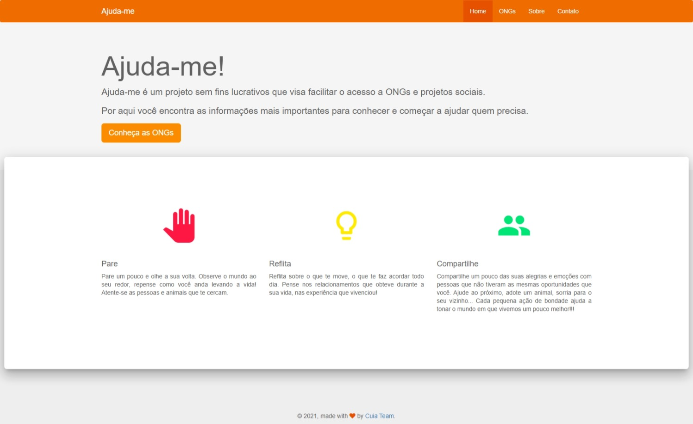

# Ajuda-me (EmberJS)

Ajude-me é um projeto que visa facilitar o contato entre doadores, voluntários e ONGs. Para tanto ele disponibiliza dados das ONGs como trabalhos realizados, tipos de favorecidos, tipos de necessidades, informações de contato e localização. Através dele o cidadão pode facilmente localizar ONGs em sua região e dessa forma incentivar e facilitar a ajuda ao próximo.

Ajuda-me é um projeto sem fins lucrativos e todas as doações e apoios as ONGs são realizadas diretamente com as mesmas.

## Pré-requisitos

Você irá precisar ter instalado em sua máquina:

* [Git](https://git-scm.com/)
* [Node.js](https://nodejs.org/) (with npm)
* [Ember CLI](https://ember-cli.com/)
* [Firebase Tools](https://firebaseopensource.com/projects/firebase/firebase-tools/)

## Instalação

* `git clone https://github.com/ziguifrido/ajudame-web.git`
* `cd ajudame-web`
* `npm install`

## Configurar o Firebase

* `cp .env-example .env`
*  Veja mais sobre a configuração do Firebase [aqui](https://firebase.google.com/docs/web/setup#config-object)!

## Execução

* `ember serve`
* Acesse o app em [http://localhost:4200](http://localhost:4200).
* Acesse os testes em [http://localhost:4200/tests](http://localhost:4200/tests).

### Gerador de código

Use vários geradores de código disponíveis, tente `ember help generate` para mais detalhes

### Testes

* `ember test`
* `ember test --server`

### Build

* `ember build` (development)
* `ember build --environment production` (production)

## Links úteis 

* [ember.js](https://emberjs.com/)
* [ember-cli](https://ember-cli.com/)
* Extensões de desenvolvimento para navegadores
  * [ember inspector for chrome](https://chrome.google.com/webstore/detail/ember-inspector/bmdblncegkenkacieihfhpjfppoconhi)
  * [ember inspector for firefox](https://addons.mozilla.org/en-US/firefox/addon/ember-inspector/)
